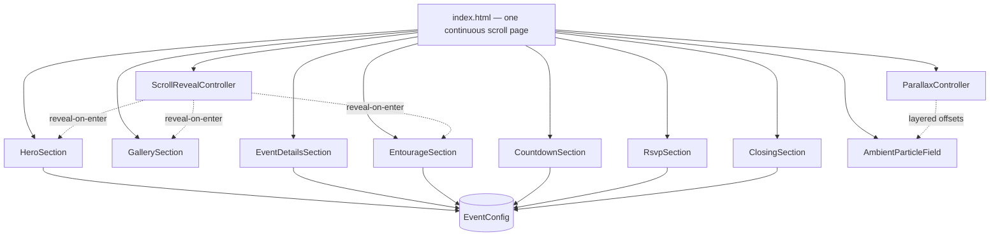
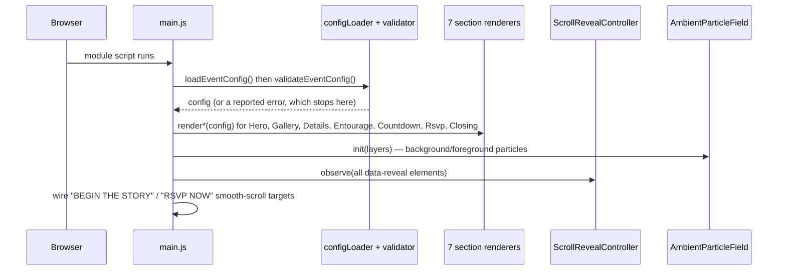
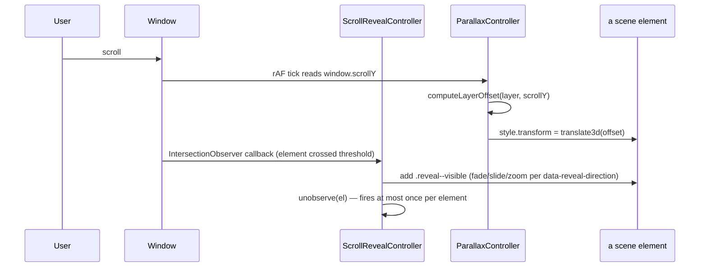
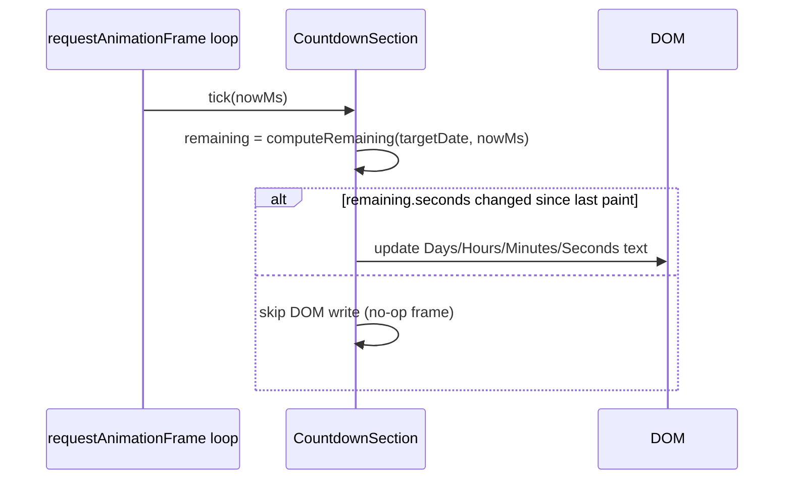
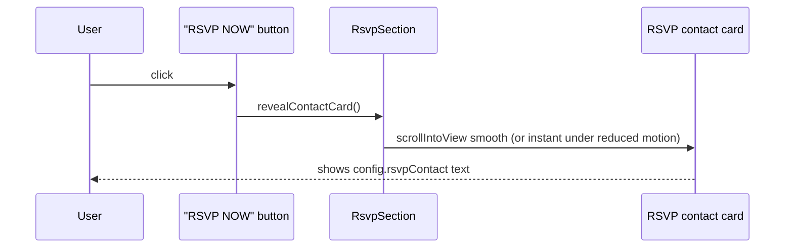

# Design Document: Fairy Birthday Invitation

> **Redesign notice (supersedes prior version):** This document replaces the
> earlier "four discrete pages joined by a click-triggered fairy-flight
> transition" design with a **single continuous scrolling page** in an
> **Enchanted Fairy Garden Princess** visual language. See
> [Migration & Module Disposition](#migration--module-disposition) for exactly
> which existing modules are kept, repurposed, or removed. The vanilla
> HTML/CSS/JS, no-build-step, no-framework foundation is unchanged.

## Overview

A mobile-first, single-page website inviting guests to Summer's 7th birthday.
The guest lands on a full-viewport opening scene and then simply **scrolls**
through seven storybook "scenes" — there is no more clicking a button to swap
between hidden pages. Each scene reveals itself as it enters the viewport
(`IntersectionObserver`-driven fade/slide/zoom), layered over a soft
parallax backdrop of cherry blossoms, petals, butterflies, and glowing fairy
dust that scrolls with the page.

The site is a static front-end build (HTML/CSS/JS, ES modules, no bundler)
with no backend or data storage. The event-day photobooth remains a
**future phase**, out of scope here (see
[Future Phase Note](#future-phase-note-photobooth)).

### Visual direction

Enchanted Fairy Garden Princess: elegant, luxurious, dreamy, storybook.
Explicitly **not** cartoon/Disney, **not** a converted-slide-deck look,
**not** boxy/corporate, **not** a generic invitation template. No harsh
colors, no large empty voids, no page-like section boundaries — the whole
site should read as one continuous, gently-lit garden.

**Color palette (exact values, replacing the earlier muted mauve/gold set):**

| Token | Hex | Use |
|---|---|---|
| Blush Pink | `#FFDCE8` | primary soft accent, card tints, petals |
| Lavender | `#DCCBFF` | secondary accent, gradient mid-tone, shadows |
| Soft Rose | `#FCEEF4` | section wash / card backgrounds |
| Ivory | `#FFFDFB` | base background, text-on-dark surfaces |
| Gold | `#D4AF37` | borders, icons, sparkle, CTA accents — sparing, never a fill |

Page background: `linear-gradient(180deg, #FFF9FC, #F7F1FF, #FFFBF8)`,
applied once on `<body>` so every scene sits on the same continuous wash
(no per-section background changes, which is what would make it read as
separate "pages" again).

### Typography system

| Role | Font | Rationale |
|---|---|---|
| Headings / display | **Playfair Display** (kept from the existing build) | Already wired into `index.html`'s Google Fonts `<link>` and into `heroSection.js`'s 3000ms font-load-timeout/fallback logic, so keeping it avoids re-plumbing font loading for no visual gain. Playfair Display's high-contrast serif with a genuine italic cut reads as storybook/editorial rather than corporate, and its display weights (600/700) hold up at hero scale. Cormorant Garamond and Cinzel were considered: Cormorant reads a little too delicate/thin for large hero type on mobile; Cinzel (all-caps-oriented, monoline) reads more "engraved plaque" than "storybook," which fits a coronation invite but not "once upon a time." Playfair Display is the best fit and has zero migration cost. |
| Subheadings / body / UI labels | **Poppins** | Geometric-but-soft sans with rounded terminals — pairs with Playfair Display without competing, stays highly legible at the 16px mobile-first floor, and (unlike Montserrat, the other option offered) its rounder letterforms read a little warmer/dreamier, which fits "magical" better than Montserrat's slightly more technical/corporate geometry. Replaces the current `--font-body` system-font stack for all decorative/user-facing text; system fonts remain only as the emergency fallback tier. |

Both are loaded via the existing Google Fonts `<link>` pattern in
`index.html` (add a second `family=Poppins:wght@400;500;600` entry
alongside the existing Playfair Display one), with the same
load-with-timeout-then-fallback-class treatment `heroSection.js` already
implements for Playfair Display, generalized to cover both fonts (see
[Component: FontLoader](#component-2-fontloader)).

### Effects: vanilla-web substitutions for Framer Motion

There is no React and no build step in this project, so Framer Motion is not
available. Every effect below is implemented with plain browser APIs that
are functionally equivalent for this site's needs:

| Framer Motion concept | Vanilla substitute used here |
|---|---|
| `whileInView` / scroll-triggered variants | `IntersectionObserver` (`ScrollRevealController`) toggling a CSS class that runs a CSS `transition`/`@keyframes` |
| `useScroll` + `useTransform` (parallax) | `window.scrollY` sampled in a `requestAnimationFrame` loop (`ParallaxController`), converted to a `transform: translate3d(...)` per layer |
| `AnimatePresence` layout crossfade | Not needed — nothing unmounts anymore (no more hidden/shown pages), so there is no exit-animation case to cover |
| Spring physics | CSS `transition-timing-function: cubic-bezier(...)` easing curves tuned to feel soft/floaty rather than linear |
| Drag/gesture layer | Not used — no drag interactions are requested |

This substitution list is the answer to "why not Framer Motion": it isn't a
missing nice-to-have, it is architecturally unavailable (no bundler/JSX
pipeline), and the vanilla primitives above cover 100% of the requested
effects (`IntersectionObserver` reveal, computed parallax, image zoom-on-scroll,
ambient particles, optional mouse parallax, smooth scrolling, glassmorphism).

## Architecture



All seven section components render once, in document order, into the
single `#app` container — none of them are ever `hidden` or removed. What
used to be "navigate to the next page" is now just "scroll further down the
document." `ScrollRevealController` and `ParallaxController` are both
cross-cutting: they don't belong to any one section, they observe/adjust
elements that any section may register.

Assumption carried forward: adding an eighth scene later means adding a
`<section>` to `index.html` and registering its reveal targets — nothing
about the controllers themselves is tied to exactly seven sections.

## Sequence Diagrams

### Page load



### Scroll: reveal + parallax while the guest scrolls



### Countdown tick



### RSVP (current no-backend behavior)



Note: `revealContactCard()` is the single seam for swapping in a real form
later — see [Component: RsvpSection](#component-6-rsvpsection).

## Components and Interfaces

### Component 1: ScrollRevealController

**Replaces**: `sectionScrollObserver.js`'s navigation model (see
[Migration & Module Disposition](#migration--module-disposition)).

**Purpose**: Fires a one-time "reveal" animation on any element as it
scrolls into view. No longer tracks "which section is current" or emits
`fromSection`/`toSection` pairs — that concept doesn't exist in a
continuous-scroll page.

**Interface**:
```pascal
INTERFACE ScrollRevealController
  PROCEDURE observe(elements: List<Element>)
  PROCEDURE revealNow(element: Element)   // reduced-motion / test escape hatch
END INTERFACE
```

**Responsibilities**:
- Each observed element carries `data-reveal-direction` ∈
  `{fade-up, slide-left, slide-right, zoom-in}`, read from the DOM rather
  than passed as a parameter, so any section can opt an element in just by
  adding the attribute.
- On first intersection past a small threshold (element ~15% into the
  viewport), add `.reveal--visible` and call `unobserve()` on that element —
  a reveal plays **at most once**; scrolling back up and down again does not
  re-trigger or flicker it.
- IF `prefers-reduced-motion` is set, `observe()` calls `revealNow()`
  synchronously for every element instead of registering an
  `IntersectionObserver` at all — every element is immediately in its final
  visible state, no animation classes are ever toggled.
- Guards against a non-browser environment (no `IntersectionObserver`): all
  elements are revealed immediately, same as the reduced-motion path.

### Component 2: FontLoader

**Purpose**: Generalizes `heroSection.js`'s existing single-font
load-with-timeout logic to cover both Playfair Display and Poppins.

**Interface**:
```pascal
INTERFACE FontLoader
  FUNCTION ensureFontsOrFallback(timeoutMs: Number): Promise<void>
END INTERFACE
```

**Responsibilities**:
- Races `document.fonts.load(...)` for both families against a single
  3000ms timeout (Requirement carried forward from the prior design).
- On timeout/failure per family, applies that family's own
  `*--fallback-font` class to the elements using it, independently — a slow
  Poppins load does not block Playfair Display from rendering, and vice
  versa.

### Component 3: ParallaxController

**Purpose**: Drives the three-layer parallax backdrop described in the
Overview (background cherry blossom branches, mid-layer petals, foreground
sparkles).

**Interface**:
```pascal
INTERFACE ParallaxController
  PROCEDURE init(layers: List<{element: Element, speed: Number}>)
  PROCEDURE enableMouseParallax(heroElement: Element)   // optional, hero only
END INTERFACE
```

**Responsibilities**:
- One `requestAnimationFrame` loop reads `window.scrollY` once per frame and
  applies `translate3d(0, scrollY * speed, 0)` to each registered layer
  element. `speed` is a small fraction (e.g. `0.08` for the slow background
  branches, `0.18` for mid-layer petals, `0.3` for foreground sparkles) so
  layers drift apart gradually rather than snapping.
- IF `prefers-reduced-motion` is set, `init()` never starts the rAF loop;
  every layer stays at its static authored position. This is the same
  "real, permanent skip" pattern `sparkleBackground.js` already uses.
- `enableMouseParallax()` is optional/progressive enhancement only: on
  devices reporting `(pointer: fine)`, a small additional offset (±6px) is
  applied to the hero's photo layer based on cursor position, recomputed in
  the same rAF loop rather than a second timer. It never runs on touch
  devices (no `mousemove` there) and is skipped entirely under reduced
  motion, matching every other motion effect in this design.
- Never lets a layer's computed offset push it more than one viewport-height
  away from its resting position (a defensive clamp), so a very long page
  can't drift a background layer completely out of frame.

### Component 4: AmbientParticleField

**Extends**: `sparkleBackground.js` (kept as the base implementation; see
Migration section). Still one full-viewport, click-through `<canvas>`,
still `requestAnimationFrame`-only, still a single static frame under
reduced motion.

**Purpose**: Renders fairy dust / glowing gold particles across the whole
page, plus the occasional butterfly crossing the screen.

**Interface**:
```pascal
INTERFACE AmbientParticleField
  PROCEDURE init()
  PROCEDURE setDensity(multiplier: Number)   // used by ClosingSection's finale
END INTERFACE
```

**Responsibilities**:
- Carries forward the existing viewport-tiered particle count (30 at
  ≤768px, 60 at >768px — Requirement 5.2's numbers), now applied to the
  ambient/gold-dust field instead of a fairy-flight trail.
- Adds a small pool of butterfly sprites (2–3 max) that occasionally drift
  across the full page width on a slow, randomized schedule, each on its
  own path independent of scroll position.
- Gold particles fade in/out on their own opacity lifecycle (same
  age/lifespan/opacity math `sparkleParticleSystem.js` already implements),
  rather than being spawned in response to a moving sprite.
- `setDensity(multiplier)` scales the active particle cap up (e.g. `1.6x`)
  for the closing scene's "background becomes more magical" requirement,
  without spawning a second canvas/animation loop.
- Reuses the frame-time degradation pattern (see
  [Component: PerformanceMonitor](#component-7-performancemonitor)): under
  sustained low frame rate, particle count and butterfly count both drop
  before anything else is cut, since they're the cheapest thing to reduce
  without losing readable content.

### Component 5: PhotoFrame (shared helper)

**Purpose**: One reusable builder for every gold-bordered photo container
used in the Hero and Gallery scenes. Real photos now exist at
`assets/summer-photos/` (see Components 9 and 10 for the current slot
assignment), so `PhotoFrame` renders a real `` today — but it is
deliberately built so a background-removed (transparent PNG) cutout of the
same subject can later replace any slot's `src` with zero layout change and
no code change.

**Background-removal limitation (current, documented constraint)**: the
user wants at least the hero photo to eventually use a background-removed
cutout rather than a plain rectangular photo. No background-removal tool or
image-processing/ML dependency is available in this environment, and none
should be installed to automate it — producing a cutout is a manual,
out-of-codebase step for later, not an implementation task here. Until a
cutout is supplied, every slot renders its plain JPG from
`assets/summer-photos/` as-is.

**Interface**:
```pascal
INTERFACE PhotoFrame
  FUNCTION build(options: {label: String, aspect: String, slot: String, src: String}): Element
END INTERFACE
```

**Responsibilities**:
- Renders a fixed-aspect-ratio container (`aspect-ratio` CSS) with a gold
  border/frame and a soft watercolor-style drop shadow, containing an
  `` sourced from
  `assets/summer-photos/`.
- Uses `object-fit: contain` on the `` (never `cover`) against the
  frame's own soft blush/ivory background wash. A hard `cover` crop is
  intentionally avoided: it would clip a full rectangular photo the same
  way today, but would also crop into a future cutout's subject or leave
  its transparent edges looking like a rendering bug. `contain` plus the
  frame's own background/gold border reads correctly either way, with no
  code change needed when a `src` is later swapped for a cutout PNG.
- `label` is still used (as the ``'s `alt` text, and as the fallback
  placeholder text — see Error Scenario 1 — if the photo fails to load).
- `aspect` controls the frame's proportions (e.g. `"3/4"` for the hero
  portrait slot, `"1/1"` for gallery slots) — unchanged.
- Marks the image with `data-photo-slot="{slot}"`; swapping in a
  background-removed cutout later is a `src`-attribute-only change (the
  element stays an ``; a transparent PNG is a normal `` source),
  the outer frame/aspect-ratio/border/shadow are all on the wrapper and
  untouched.

### Component 6: RsvpSection

**Purpose**: "Reserve Your Magical Seat" heading, floral frame, `RSVP NOW`
button.

**Interface**:
```pascal
INTERFACE RsvpSection
  PROCEDURE render(config: EventConfig)
  PROCEDURE revealContactCard()
END INTERFACE
```

**Responsibilities**:
- `render(config)` renders the heading, decorative floral frame, and the
  `RSVP NOW` button, plus a contact card (built the same way
  `EventDetailsSection`'s glass card is — see
  [Component: GlassCard](#component-8-glasscard)) that starts visually
  de-emphasized (not `hidden`, so it's still in the DOM/reachable by
  scroll/AT, just styled to draw the eye only after the button is pressed).
- `render(config)` also wires the `RSVP NOW` button's click behavior based
  on `config.rsvpLink`:
  - WHERE `config.rsvpLink` is present and non-empty: the button opens
    `config.rsvpLink` in a new tab with `target="_blank" rel="noopener
    noreferrer"` (required whenever external content opens in a new tab,
    so the opened page cannot obtain a `window.opener` reference back to
    this site — see [Security Considerations](#security-considerations)).
    `revealContactCard()` is not called in this branch.
  - WHERE `config.rsvpLink` is absent or empty — the current state, until
    the user supplies their real lu.ma URL — the button calls
    `revealContactCard()`, exactly as in the prior design.
- `revealContactCard()` itself is unchanged: adds an "emphasized" class to
  the contact card and smooth-scrolls (instant under reduced motion) it
  into view, displaying `config.rsvpContact` verbatim; still submits no
  data anywhere.
- **Extension point promoted from future to present**: the `rsvpLink`
  field previously documented here as a "future extension point, not
  implemented" is now a real, optional `EventConfig` field — see
  [Model 1](#model-1-eventconfig--unchanged-schema-plus-one-new-optional-field).
  Supplying the real lu.ma URL later requires only an `eventConfig.js`
  edit; today's empty value keeps the `revealContactCard()` fallback path
  active with no visible behavior change from the prior design.

### Component 7: PerformanceMonitor

**Extracted from**: `fairyTransitionController.js`'s frame-time
degradation logic (see Migration section) — the *technique* (sliding
2000ms window, rolling-average threshold, one-way "degraded" flag) is
reused verbatim; only its home module and what it degrades have changed.

**Interface**:
```pascal
INTERFACE PerformanceMonitor
  PROCEDURE recordFrame(nowMs: Number)
  FUNCTION isDegraded(): Boolean
END INTERFACE
```

**Responsibilities**:
- Identical detection rule as before: a rolling-average frame time ≥33ms
  sustained for ≥2000ms flips `isDegraded()` to `true`, permanently, for the
  rest of the session.
- Consumers (`ParallaxController`, `AmbientParticleField`) each poll
  `isDegraded()` and apply their own 50%-reduction-with-floor response
  independently — `ParallaxController` disables layer offsets first
  (cheapest, least visible loss), `AmbientParticleField` halves its
  particle/butterfly cap next (floor of 10 particles, matching the prior
  design's floor).

### Component 8: GlassCard (shared helper)

**Purpose**: One shared "luxury floating glassmorphism card" builder, used
by `EventDetailsSection`, `CountdownSection`, and `RsvpSection`'s contact
card, so the frosted-glass look, gold accents, and rounded corners stay
visually consistent across all three without three separate
implementations.

**Interface**:
```pascal
INTERFACE GlassCard
  FUNCTION build(options: {ariaLabel: String}): {card: Element, body: Element}
END INTERFACE
```

**Responsibilities**:
- Renders a `<div class="glass-card">` with `backdrop-filter: blur(...)`
  plus a translucent Soft-Rose/Ivory background tint and a thin Gold
  border/rounded corners.
- `@supports not (backdrop-filter: blur(1px))` fallback rule (declared once
  in `styles/glass.css`, applied automatically to every `.glass-card`):
  raises the background tint's opacity so the card is still clearly
  readable without any blur, on the (now rare) browsers that don't support
  `backdrop-filter`. No JS feature-detection needed — this is a pure CSS
  fallback.
- Every `GlassCard` is a real, focusable, ARIA-labeled landmark
  (`ariaLabel` option), not a decorative div — the event details, the
  countdown, and the RSVP contact card are all meaningful content.

### Component 9: HeroSection (rewritten)

**Purpose**: The opening scene.

**Interface**:
```pascal
INTERFACE HeroSection
  PROCEDURE render(config: EventConfig)
END INTERFACE
```

**Responsibilities**:
- Renders the exact copy: "ONCE UPON A TIME...", "A little princess is
  turning seven.", "Join us as we celebrate", the headline
  "SUMMER'S 7TH BIRTHDAY" (built from `config.childName`/`config.age`, not
  hardcoded, so the literal digit "7" always matches `config.age`), then
  `config.eventDate` and `config.venueName` — both rendered exactly as
  authored (no timezone conversion; same rule as before, still enforced).
- Renders a large `PhotoFrame` ("hero" slot, `src:
  assets/summer-photos/04a7fc0e-e895-4d6d-a7d7-6adc9c6dfcc3.jpg` — a
  starting assignment the user can freely reorder later, not a hard
  requirement) with a soft magical lighting overlay (a CSS radial-gradient
  wash over the frame, not a filter on the photo itself, so the overlay
  still reads correctly whether the source is today's plain JPG or a future
  background-removed cutout of the same subject).
- Renders the `BEGIN THE STORY` button (replaces `Enter the Garden`). On
  click, it calls `document.getElementById('gallery').scrollIntoView({behavior:
  reducedMotion ? 'auto' : 'smooth'})` — a plain scroll, not
  `triggerFairyTransition()`, and not `goToNext()`.
- Registers its own decorative butterflies/petals/sparkles as
  `data-reveal-direction="fade-up"` targets for `ScrollRevealController`, so
  they drift in gently rather than appearing instantly, even on first load.

### Component 10: GallerySection (new) — "Princess Gallery"

**Purpose**: One gallery scene with three photo slots (now real photos from
`assets/summer-photos/`, cutout-ready per Component 5) in a staggered
scrapbook layout.

**Interface**:
```pascal
INTERFACE GallerySection
  PROCEDURE render()
END INTERFACE
```

**Slot mapping** (clarifying the brief's "image 2/3/4" numbering against
this design's three actual slots, now with real photo files assigned):

| Slot | Position | Reveal direction | `PhotoFrame` aspect | Photo file (`assets/summer-photos/`) |
|---|---|---|---|---|
| `gallery-main` | main, center, largest | zoom-in (fade + scale up) | `3/4` | `0c916870-f108-4633-924f-b9470ad9cbe1.jpg` |
| `gallery-left` | staggered, lower-left | slide-left | `1/1` | `1fa9e8ef-131b-4c0c-9129-dd6d8c88988d.jpg` |
| `gallery-right` | staggered, lower-right | slide-right | `1/1` | `35afc0da-58f4-4fa5-b474-78f35f8fdf65.jpg` |

This is a starting assignment the user can freely reorder later, not a hard
requirement. The remaining four photos in `assets/summer-photos/`
(`370dc895-7f9a-4e9b-bbc8-e7e1c0606de6.jpg`,
`4ab9af4f-7d64-4941-80b9-cf1b07278b27.jpg`,
`7840819e-4325-49ff-95ce-3a6c4d6bb26c.jpg`,
`89ddacad-42bb-4c38-82b0-58e43c10f07d.jpg`) are unused by today's 3-slot
gallery and are available for a future gallery expansion (e.g. a 4th/5th
slot) — out of scope for this design.

**Responsibilities**:
- All three slots are `PhotoFrame`s rendering the real photos in the table
  above, with gold decorative frames and a watercolor-shadow treatment;
  floating blossom decorations sit between them as separate
  `ScrollRevealController` targets (`fade-up`) so they drift in slightly
  after the photos.
- The section itself carries no photo content from `EventConfig` — there is
  no gallery data in the config schema, and none is added by this design
  (see [Data Models](#data-models)); the three photo files above are static
  asset references baked into `GallerySection`, not config-driven. Each
  slot keeps `PhotoFrame`'s `object-fit: contain` cutout-ready treatment
  (Component 5), so any of the three can later be swapped for a
  background-removed cutout with no layout change.

### Component 11: EventDetailsSection (rewritten presentation)

**Purpose**: Same field-mapping responsibility as before, restyled as a
floating `GlassCard` over a floral backdrop layer (a `ParallaxController`
mid-layer target).

**Interface**: unchanged shape, `renderDetails(config)`.

**Field mapping** (all values pulled from `EventConfig`, never hardcoded —
carries forward Requirement 6's config-driven rule):

| Label shown | Config field | Note |
|---|---|---|
| DATE | `config.eventDate` | rendered exactly as authored |
| TIME | `config.eventTime` | rendered exactly as authored |
| VENUE | `config.venueName` | |
| ADDRESS | `config.venueAddress` | |
| DRESS CODE | `config.themeNote` | the brief's mock copy ("Pastel Fairy Garden") is a short example label; the real config's `themeNote` is a full sentence ("Dress code: pastel colors only…") — this design renders that real value verbatim under a "DRESS CODE" label rather than hardcoding the shorter mock text, per the config-driven-content rule. |
| DRESS CODE swatches | `config.themeColors` | a row of small filled color circles rendered beneath the `themeNote` text, one circle per entry in `themeColors`, in array order — presentation-only, no new validation (each entry is already a validated hex string per Requirement 12.2). Reinforces the text instruction visually; does not replace it. |
| RSVP | `config.rsvpContact` | same "render real value, don't hardcode the mock's shortened line" rule |
| *(optional)* how to get there | `config.mapLink` | unchanged from the prior design: rendered only when present (Requirement 2.7/2.9), now as a gold-underlined link row inside the same glass card |
| *(optional)* gift note | `config.giftNote` | unchanged: rendered only when present (Requirement 2.8/2.10) |

- The decorative floral backdrop is a `ParallaxController` layer sitting
  *behind* the glass card (the card's blur is what makes "floating over a
  floral backdrop" actually read correctly — without the backdrop-filter,
  this would just be a card next to some flowers, not "floating over"
  them).

### Component 12: EntourageSection (rewritten presentation) — "The Royal Entourage"

**Purpose**: Same data as before — do not shorten it. `config.entourage`
already holds the real 6 role groups and 49 names (7 Roses, 7 Candles,
7 Blind Box, 7 Shoes, 7 Wishes, 7 Pajamas); the brief's "7 Roses / 7 Candles
/ 7 Gifts" is a 3-group *illustrative example* from the redesign prompt, not
a request to trim the real data. This design renders `config.entourage` in
full, unmodified.

**Interface**: unchanged shape, `renderEntourage(config)`.

**Responsibilities**:
- Presents the six groups as a vertical "magical timeline": a central gold
  connecting line, each group as a timeline stop with a small floral divider
  between stops.
- Each group is its own `ScrollRevealController` target
  (`data-reveal-direction="fade-up"`), so groups animate in one at a time
  as the guest scrolls down the timeline, rather than all six appearing at
  once.
- Member names within a group render exactly as before (`textContent` only,
  never `innerHTML` — unchanged XSS-safety convention).

### Component 13: CountdownSection (new)

**Purpose**: Live countdown to the event.

**Interface**:
```pascal
INTERFACE CountdownSection
  PROCEDURE render(config: EventConfig)
  FUNCTION computeRemaining(targetDate: Date, nowMs: Number): {days, hours, minutes, seconds, isPast: Boolean}
END INTERFACE
```

**Responsibilities**:
- `render(config)` builds `targetDate` once, from
  `config.eventDate` + `config.eventTime` combined into a single `Date`.
  **Design decision (distinct from the display-only no-timezone-conversion
  rule elsewhere)**: the target instant is constructed using the guest
  device's local time components (i.e. "3:00 PM" is treated as 3:00 PM in
  whatever timezone the countdown is being viewed from). This is a
  deliberate simplification appropriate for a single-venue family event
  where the invitation link is expected to be opened by guests in the same
  region as the venue; it is documented here as an assumption, not silently
  decided in code.
- The DOM update is driven by `requestAnimationFrame`, not `setInterval`
  (keeping the project's existing "animation loops are rAF-only" rule) —
  but it only *writes* to the DOM when the integer seconds value actually
  changes since the last paint, so it costs nothing extra per frame beyond
  the cheap subtraction in `computeRemaining()`.
- `computeRemaining()` never returns negative components. Once
  `nowMs >= targetDate`, `isPast` is `true` and all four numbers are `0`;
  `render()` swaps the numeric display for a small "Today!" state in that
  case (see [Error Handling](#error-scenario-5-countdown-target-already-passed)).
- Renders inside a `GlassCard`, with a thin ring of small gold sparkle
  glyphs positioned around the four numbers (static decorative SVGs, not
  particles — cheaper, and they don't need to move to read as "magical" at
  this small scale).

### Component 14: ClosingSection (rewritten presentation)

**Purpose**: The ending scene.

**Interface**: unchanged shape, `renderClosing(config)`.

**Responsibilities**:
- Renders the exact copy: "Thank you for being part of Summer's magical
  celebration.", "We cannot wait to see you in our enchanted garden.", then
  "With Love," and `config.childName` on its own line (not the hardcoded
  word "Summer" — the name must come from config so this still works if the
  child's name ever changes).
- When this section first enters the viewport (its own
  `ScrollRevealController` target), it calls
  `AmbientParticleField.setDensity(1.6)` once — the "background becomes
  more magical" requirement is implemented as a density bump on the
  existing field, not a second, separate particle system.

## Data Models

### Model 1: EventConfig — unchanged schema, plus one new optional field

`childName`, `age`, `eventDate`, `eventTime`, `venueName`, `venueAddress`,
`mapLink` (optional), `rsvpContact`, `themeNote`, `giftNote` (optional),
`message` (optional), `themeColors`, `entourage` all carry forward with
their existing validation rules from the prior design — that validation
logic (`eventConfigValidator.js`) is untouched by this redesign for these
fields.

**New field**: `rsvpLink: String` (optional) — a lu.ma (or other) event
URL. WHERE present, it is validated the same way as `mapLink` (non-empty
string, maximum 500 characters — see Requirement 12.5); WHERE absent or
empty, `RsvpSection` uses the existing no-backend contact-card-reveal
behavior (see [Component 6](#component-6-rsvpsection)). This promotes the
field previously documented here as a "future extension point, not
implemented" to a real, implemented, optional field — the user has not yet
supplied their real lu.ma URL, so `eventConfig.js` carries it as an empty
string placeholder for now (see `tasks.md`).

**Content change (not a schema change)**: `themeColors` should be updated,
as an implementation task, to the five exact hex values this design
specifies (`#FFDCE8`, `#DCCBFF`, `#FCEEF4`, `#FFFDFB`, `#D4AF37`), replacing
the previous five-color set. This keeps the config-driven theme in sync
with the CSS custom properties below rather than the two silently
diverging.

### Model 2: RevealState (new, per-element, transient — not persisted)

```pascal
STRUCTURE RevealState
  element: Element
  direction: Enum{fade-up, slide-left, slide-right, zoom-in}
  revealed: Boolean       // true after the one-time reveal has fired
END STRUCTURE
```

**Validation Rules**:
- `revealed` only ever transitions `false -> true`, never back — enforces
  "at most once per element."

### Model 3: ParallaxLayer (new)

```pascal
STRUCTURE ParallaxLayer
  element: Element
  speed: Number            // small fraction, e.g. 0.08 / 0.18 / 0.3
  offsetY: Number          // last computed transform offset, px
END STRUCTURE
```

**Validation Rules**:
- `abs(offsetY)` never exceeds one viewport height (defensive clamp, see
  `ParallaxController`).

### Model 4: CountdownTarget (new)

```pascal
STRUCTURE CountdownRemaining
  days: Integer            // >= 0
  hours: Integer           // 0-23
  minutes: Integer         // 0-59
  seconds: Integer         // 0-59
  isPast: Boolean
END STRUCTURE
```

**Validation Rules**:
- All four numeric fields are `>= 0` always; `isPast = true` forces all four
  to `0`.

### Model 5: EventConfig CSS binding (documentation, not a code structure)

`styles/base.css`'s custom properties are updated 1:1 with the new palette:

```pascal
--color-blush-pink:  #FFDCE8
--color-lavender:    #DCCBFF
--color-soft-rose:   #FCEEF4
--color-ivory:       #FFFDFB
--color-gold:        #D4AF37
--bg-gradient: linear-gradient(180deg, #FFF9FC, #F7F1FF, #FFFBF8)
```

These replace `--color-accent-lavender`/`--color-accent-pink`/
`--color-accent-gold`/`--color-bg-gradient-*` from the prior design 1:1 by
role (same variable *purpose*, new hex value), so every existing consumer of
those variables (buttons, borders, the ambient particle palette in
`sparkleBackground.js`) picks up the new look automatically once the
variable values are changed — no per-consumer rewrite needed for color
alone.

## Algorithmic Pseudocode

### ScrollRevealController.observe

```pascal
ALGORITHM observe(elements)
INPUT: elements of type List<Element>
OUTPUT: none (mutates DOM classes over time)

BEGIN
  IF userPrefersReducedMotion() OR NOT hasIntersectionObserver() THEN
    FOR each el IN elements DO
      revealNow(el)
    END FOR
    RETURN
  END IF

  observer ← NEW IntersectionObserver(PROCEDURE(entries)
    FOR each entry IN entries DO
      IF entry.isIntersecting THEN
        entry.target.classList.add("reveal--visible")
        observer.unobserve(entry.target)
      END IF
    END FOR
  END PROCEDURE, { threshold: 0.15 })

  FOR each el IN elements DO
    observer.observe(el)
  END FOR
END
```

**Preconditions:**
- `elements` are already in the DOM (no reveal target is created lazily
  after `observe()` runs).

**Postconditions:**
- Every element in `elements` eventually carries `.reveal--visible` exactly
  once, whether via the observer path or the reduced-motion/no-support path.
- No element is ever un-revealed once revealed.

**Loop Invariants:**
- The set of elements still under active observation only shrinks (via
  `unobserve`), never grows, over the life of a single `observe()` call.

### ParallaxController tick

```pascal
ALGORITHM parallaxTick(layers)
INPUT: layers of type List<ParallaxLayer>
OUTPUT: none (mutates each layer.element's transform)

BEGIN
  scrollY ← window.scrollY
  maxOffset ← window.innerHeight

  FOR each layer IN layers DO
    raw ← scrollY * layer.speed
    layer.offsetY ← clamp(raw, -maxOffset, maxOffset)

    ASSERT abs(layer.offsetY) <= maxOffset

    layer.element.style.transform ← "translate3d(0, " + layer.offsetY + "px, 0)"
  END FOR

  AWAIT nextAnimationFrame()
  parallaxTick(layers)
END
```

**Preconditions:**
- `init(layers)` has already registered at least one layer;
  `userPrefersReducedMotion() = false` (otherwise this loop is never
  started at all — see Component 3).

**Postconditions:**
- Every layer's `offsetY` stays within `[-maxOffset, maxOffset]` on every
  frame.

**Loop Invariants:**
- `abs(layer.offsetY) <= window.innerHeight` holds at the end of every
  iteration, for every layer, on every frame.

### CountdownSection.computeRemaining

```pascal
ALGORITHM computeRemaining(targetDate, nowMs)
INPUT: targetDate of type Date, nowMs of type Number
OUTPUT: remaining of type CountdownRemaining

BEGIN
  deltaMs ← targetDate.getTime() - nowMs

  IF deltaMs <= 0 THEN
    RETURN { days: 0, hours: 0, minutes: 0, seconds: 0, isPast: true }
  END IF

  totalSeconds ← floor(deltaMs / 1000)

  remaining.days    ← floor(totalSeconds / 86400)
  remaining.hours   ← floor(totalSeconds / 3600) MOD 24
  remaining.minutes ← floor(totalSeconds / 60) MOD 60
  remaining.seconds ← totalSeconds MOD 60
  remaining.isPast  ← false

  ASSERT remaining.days >= 0 AND remaining.hours IN [0, 23]
  ASSERT remaining.minutes IN [0, 59] AND remaining.seconds IN [0, 59]

  RETURN remaining
END
```

**Preconditions:**
- `targetDate` is a valid `Date` (constructed once from
  `config.eventDate`/`config.eventTime`, which have already passed
  `eventConfigValidator.js`'s validation).

**Postconditions:**
- All four numeric fields are non-negative; `hours/minutes/seconds` are each
  bounded to their natural ranges.
- `isPast = true` if and only if `nowMs >= targetDate.getTime()`.

**Loop Invariants:** N/A (pure function, no loop).

## Example Usage

```pascal
SEQUENCE
  config ← loadEventConfig()
  validateEventConfig(config)   // stops and reports on failure, per Error Handling

  heroSection.render(config)
  gallerySection.render()
  eventDetailsSection.render(config)
  entourageSection.render(config)
  countdownSection.render(config)
  rsvpSection.render(config)
  closingSection.render(config)

  ambientParticleField.init()
  parallaxController.init(collectParallaxLayers())
  scrollRevealController.observe(collectRevealTargets())

  heroBeginButton.onClick ← PROCEDURE()
    scrollIntoView("gallery", smoothUnlessReducedMotion)
  END PROCEDURE

  rsvpNowButton.onClick ← PROCEDURE()
    rsvpSection.revealContactCard()
  END PROCEDURE
END SEQUENCE
```

## Correctness Properties

### Property 1: No horizontal overflow across supported viewport widths

For all viewport widths `w` where `320 <= w <= 1920`, no scene causes
horizontal scroll or content overflow — unchanged from the prior design,
now checked across all seven scenes instead of four.

**Validates: Requirements 9.1, 9.3**

### Property 2: Every reveal fires at most once per element

For any element observed by `ScrollRevealController`, `.reveal--visible` is
added at most once over the element's lifetime, regardless of how many
times the guest scrolls past it in either direction.

**Validates: Requirements 8.2**

### Property 3: Reduced motion replaces every scroll/parallax animation with an instant final state

For all devices with `prefers-reduced-motion: reduce`: every
`ScrollRevealController` target is immediately `.reveal--visible` with no
transition ever applied; `ParallaxController.init()` never starts its rAF
loop, and every layer stays at its authored resting position;
`AmbientParticleField` renders exactly one static frame.

**Validates: Requirements 10.1, 10.2**

### Property 4: Parallax offsets stay within one viewport height

For all frames while scrolling, every `ParallaxLayer.offsetY` is within
`[-window.innerHeight, window.innerHeight]`.

**Validates: Requirements 8.4**

### Property 5: Countdown numbers are never negative and clamp correctly at the target

For all `nowMs` values, `computeRemaining(targetDate, nowMs)` returns
`days, hours, minutes, seconds >= 0`; for all `nowMs >= targetDate`, every
field is `0` and `isPast = true`.

**Validates: Requirements 5.4, 5.5**

### Property 6: Ambient particle cap scales with viewport width and with degraded-mode/density multiplier

For all viewport widths `w <= 768`, the base cap is 30; for `w > 768`, 60.
Under `PerformanceMonitor.isDegraded() = true`, the effective cap is
`max(10, base * 0.5)`. Under `ClosingSection`'s density bump, the effective
cap is `base * 1.6` (bump and degradation are mutually exclusive in
practice — degradation, once triggered, wins, since a struggling device
should never be pushed to render *more* particles).

**Validates: Requirements 11.2, 11.4**

### Property 7: EventConfig values render exactly, with no timezone conversion, in every scene that shows them

For every scene displaying `childName`, `age`, `eventDate`, `eventTime`,
`venueName`, or `venueAddress` (Hero, EventDetails, and — for the countdown
math specifically, see Component 13's documented assumption —
CountdownSection), the *display* value matches the config value exactly,
with no timezone conversion applied to the displayed string.

**Validates: Requirements 12.1, 3.5**

### Property 8: Optional fields render only when present, with no placeholder content

Unchanged from the prior design: for `mapLink` absent, no "how to get
there" link and no placeholder in its place; present, it renders as a link.
Same rule for `giftNote`.

**Validates: Requirements 3.6, 3.7**

### Property 9: The entourage renders the full real dataset, not a shortened example

For the rendered entourage timeline, the number of role groups equals
`config.entourage.length` (6, for the current real data) and the total
member count across all groups equals the sum of every group's
`members.length` (49, for the current real data) — the brief's shorter
3-category illustrative example is never substituted for the real config
data.

**Validates: Requirements 4.1**

### Property 10: Glassmorphism cards remain readable without `backdrop-filter` support

For any browser where `backdrop-filter` is unsupported, every `.glass-card`
still meets a readable contrast ratio against its content via the
`@supports not (...)` fallback background tint, with no reliance on the
blur itself for legibility.

**Validates: Requirements 3.8, 10.4**

### Property 11: Dress-code swatches match `config.themeColors` exactly

For the rendered dress-code swatch row, the number of rendered circles
equals `config.themeColors.length`, and each circle's rendered color (CSS
`background-color`) equals the corresponding hex value in
`config.themeColors`, in array order.

**Validates: Requirements 3.9**

## Error Handling

### Error Scenario 1: Photo file missing or fails to load

**Condition**: A `PhotoFrame` slot's assigned photo file
(`assets/summer-photos/...`) is missing, renamed, or fails to load — no
longer the expected default state now that real photos exist, but still
possible (e.g. a deployment missing the `assets/` folder, or a future
cutout PNG path typo).
**Response**: Fall back to the styled gold-bordered placeholder with the
slot's `label`; never a broken-image icon, never blank space.
**Recovery**: Restore the correct file at the path/filename documented in
Components 5, 9, and 10 — no layout/CSS change needed either way, per
Component 5's `object-fit: contain` treatment.

### Error Scenario 2: Decorative font fails to load

**Condition**: Playfair Display or Poppins does not finish loading within
3000ms of `ensureFontsOrFallback()` starting (unchanged mechanism from the
prior design, now covering two families independently).
**Response**: Apply that family's fallback class; the other family is
unaffected.
**Recovery**: N/A — fallback is immediate and sufficient; no retry needed
for text fonts (unlike the sprite-asset retry in the old design, a fallback
system font is always fully acceptable here).

### Error Scenario 3: EventConfig missing or malformed (field-level)

**Condition**: Any required field fails `eventConfigValidator.js`'s
existing rules. Unchanged from the prior design.
**Response**: Prevent rendering of all seven scenes and produce an
observable error identifying which field(s) failed.
**Recovery**: Fix the config file and rebuild.

### Error Scenario 4: EventConfig source fails to load or parse

**Condition**: The config module itself can't be imported/parsed. Unchanged
from the prior design (`configLoader.js`'s `ConfigLoadError`).
**Response**: Prevent rendering, produce a distinct "could not be loaded"
error.
**Recovery**: Fix/restore the config source and rebuild.

### Error Scenario 5: Countdown target already passed

**Condition**: `computeRemaining()` returns `isPast = true` (the event date
has arrived or passed by the time a guest opens the link).
**Response**: `CountdownSection` swaps its four-number display for a small
"Today!" (or "We celebrated!" if noticeably past — implementation detail,
not a new requirement) state, rather than showing `0d 0h 0m 0s` indefinitely
or, worse, negative numbers.
**Recovery**: N/A — this is expected end-of-life behavior for a countdown,
not a failure to recover from.

### Error Scenario 6: Sustained low frame rate (generalized from the prior "low-end device" scenario)

**Condition**: `PerformanceMonitor` detects a rolling-average frame time
≥33ms sustained for ≥2000ms.
**Response**: `ParallaxController` stops applying per-frame offsets
(layers freeze at their current position — cheapest fix, least visible);
`AmbientParticleField` halves its particle/butterfly cap (floor of 10).
**Recovery**: Both effects continue at reduced fidelity; nothing freezes or
blocks scrolling, matching the prior design's recovery guarantee.

## Testing Strategy

### What carries forward unchanged

- `EventConfig` field-level validation tests (existing, untouched schema).
- Config-source-load-failure vs. field-validation-failure distinction tests
  (existing, untouched modules).
- The XSS-safety convention (`textContent`/`createElement`, never
  `innerHTML` for config-provided strings) — still verified the same way
  for `EntourageSection`/`EventDetailsSection`/`ClosingSection`/
  `CountdownSection` (countdown numbers are also `textContent`-only).

### What must be rewritten

Most existing property/unit tests tied to the page-swap model no longer
apply and must be rewritten or removed, specifically any test currently
targeting: `fairyTransitionController.js`'s `triggerFairyTransition`,
`isTransitioning`, `hasAdjacentSection`, `computeFlightPath`/
`evaluatePathAt`, `playSimpleCrossFade`; and `sectionScrollObserver.js`'s
`goToNext`/`goToPrevious`/`onSectionChange(from, to)`/`getCurrentSection`.
None of those concepts exist in the new architecture.

### New unit tests

- `ScrollRevealController`: reveal-once behavior (scrolling an element into
  view twice only reveals once); reduced-motion path reveals every element
  synchronously with no observer created.
- `ParallaxController`: offset clamping at the viewport-height boundary;
  reduced-motion path never starts the rAF loop.
- `CountdownSection.computeRemaining`: zero/negative-delta clamps to all-zero
  + `isPast`; day/hour/minute/second rollover boundaries (e.g. exactly
  86400000ms remaining).
- `PerformanceMonitor`: the same rolling-window degradation tests the prior
  design specified for `fairyTransitionController.js`, moved to this new
  home.
- `RsvpSection`: button-wiring branch on `config.rsvpLink` — link present
  opens a new tab with `noopener noreferrer` and does not call
  `revealContactCard()`; link absent/empty falls back to
  `revealContactCard()`.

### New property-based tests (fast-check)

- Property 2 (reveal fires at most once) — for any sequence of simulated
  intersection events for a given element, `.reveal--visible` is added at
  most once.
- Property 4 (parallax offset bounds) — for any generated `scrollY` and
  layer `speed`, computed `offsetY` stays within
  `[-viewportHeight, viewportHeight]`.
- Property 5 (countdown never negative) — for any generated
  `(targetDate, nowMs)` pair, all four fields are `>= 0` and correctly
  clamp when `nowMs >= targetDate`.
- Property 6 (particle cap scaling) — for any viewport width and
  degraded/density-multiplier combination, the effective cap matches the
  documented formula.
- Property 9 (full entourage dataset) — for any well-formed
  `config.entourage`, the rendered group count and total member count match
  the input exactly (regression guard against ever re-introducing a
  shortened/example dataset).
- Property 11 (dress-code swatch match) — for any generated
  `config.themeColors` array, the rendered swatch count and each swatch's
  color match the input exactly, in order.

### Manual/integration testing (unchanged categories, re-scoped)

- Manual check with OS-level reduced motion enabled, now covering all seven
  scenes (not four): confirm every reveal/parallax/particle effect degrades
  to an instant/static state.
- Manual mobile device check across the full page for scroll smoothness and
  absence of horizontal overflow, 320px–1920px.
- Manual visual QA of the new palette/typography across breakpoints: 320,
  375, 768, 1024, 1440, 1920px.

**Property Test Library**: fast-check (unchanged, already a devDependency).

## Performance Considerations

- Parallax and reveal both read `window.scrollY`/`IntersectionObserver`
  entries only — never layout-triggering reads like `getBoundingClientRect`
  inside the per-frame parallax loop, to avoid forced synchronous layout on
  every scroll frame.
- `translate3d`/`transform` only (never `top`/`left`) for all
  parallax/reveal motion, so the browser can composite these on the GPU
  without triggering layout or paint.
- `AmbientParticleField` remains a single canvas (not one per layer), same
  as the prior design, to keep the animation loop's per-frame cost bounded
  regardless of how many visual "layers" of dust/butterflies it renders.
- Images/decorative assets below the fold remain lazy-loaded once real
  photos are added (`loading="lazy"` on the eventual `` tags — already
  planned for by `PhotoFrame`'s drop-in-later design).

## Security Considerations

- Unchanged from the prior design: static site, no user input/data
  collection, no auth/storage. Served over HTTPS; no third-party scripts
  beyond the pinned Google Fonts `<link>`s. No PII collected or stored.
- `RsvpSection`'s contact-card fallback behavior (`rsvpLink` absent) stores
  nothing and submits nothing — it is pure client-side DOM reveal of
  already-public config text.
- `RsvpSection`'s `rsvpLink`-present branch opens an external,
  user-supplied URL (a lu.ma event page) in a new tab with `rel="noopener
  noreferrer"`, preventing the opened page from obtaining a `window.opener`
  reference back to this site. No other external navigation is introduced
  by this design.

## Dependencies

- No new required third-party JS dependency — same vanilla
  HTML/CSS/JS/`requestAnimationFrame` foundation as before.
- Two Google Fonts families now (Playfair Display, already present;
  Poppins, newly added) via the existing pinned `<link>` pattern in
  `index.html`.
- `fast-check` remains the only devDependency, for the new property tests
  above.
- No image-processing/ML dependency is added for background removal — that
  step, if performed, happens outside this codebase (see Component 5's
  documented limitation); this design only needs `PhotoFrame` to tolerate
  a cutout file arriving later.

## Migration & Module Disposition

| Module | Disposition | Notes |
|---|---|---|
| `fairyTransitionController.js` | **Removed** | Its core purpose — click-triggered flight between two *discrete, hidden* sections — has no equivalent in a continuous-scroll page. Its frame-degradation *technique* is extracted into the new `performanceMonitor.js` (Component 7) before deletion; nothing else from this file is kept. |
| `sectionScrollObserver.js` | **Removed, IntersectionObserver plumbing repurposed** | The "current section index" / `goToNext`/`goToPrevious`/`onSectionChange(from, to)` navigation API is gone — there's no discrete "current section" concept anymore. Its `IntersectionObserver` usage pattern is the starting point for the new `scrollRevealController.js`, but the new module's contract (`observe(elements)`, fire-once-per-element) is different enough that this is a rewrite, not a refactor. |
| `sparkleParticleSystem.js` | **Repurposed** | The particle data structure and age/opacity/lifecycle math, plus the device-tier particle cap, move into `AmbientParticleField`'s foreground layer wholesale — this logic was never actually fairy-sprite-specific, so it transfers directly. |
| `sparkleBackground.js` | **Extended, kept as-is at its core** | Becomes the base implementation of `AmbientParticleField`: same canvas/idempotent-init/reduced-motion pattern, extended with butterfly sprites and a `setDensity()` multiplier. |
| `heroSection.js` | **Rewritten** | New copy, new CTA behavior (`scrollIntoView`, not `triggerFairyTransition`/`goToNext`), new `PhotoFrame` hero slot. |
| `eventDetailsSection.js` | **Rewritten presentation, field-mapping logic kept** | Restyled into a `GlassCard`; the config-field-to-label mapping and the mapLink/giftNote optional-rendering rules are unchanged in substance. |
| `entourageSection.js` | **Rewritten presentation, data mapping kept** | Restyled as a "magical timeline"; still renders the full real `config.entourage` (6 groups, 49 names) via the existing `textContent`-only rendering approach. |
| `closingSection.js` | **Rewritten presentation** | New exact copy; adds the one-line `AmbientParticleField.setDensity()` call on first reveal. |
| `main.js` | **Rewritten wiring** | No more `SECTION_IDS` navigation array or delegated `.section-next-btn` click handler; instead mounts all seven sections once and wires `ScrollRevealController`/`ParallaxController`/`AmbientParticleField`/`FontLoader` plus the two smooth-scroll CTAs (hero, RSVP). |
| `index.html` | **Rewritten structure** | All seven `<section>`s present and never `hidden`; adds gallery/countdown/rsvp containers and the parallax layer/canvas host elements; adds the Poppins font `<link>`. |
| `eventConfigValidator.js`, `configLoader.js`, `configErrorReporter.js`, `eventConfig.js` | **Unchanged** | No schema or validation-rule changes; only `eventConfig.js`'s `themeColors` *values* are updated to the new palette as a content change. |

## Future Phase Note: Photobooth

Unchanged from the prior design: the event-day photobooth (guests
viewing/uploading images) remains out of scope for this spec. It will
require, in a future phase, backend/storage for uploaded images, a guest
upload flow, and a gallery viewing UI — the latter can reuse this
redesign's `PhotoFrame`/`GlassCard`/parallax visual system once photo data
exists. The previously-noted tentative Google Drive-based storage plan is
still just a plan, not implemented here.
